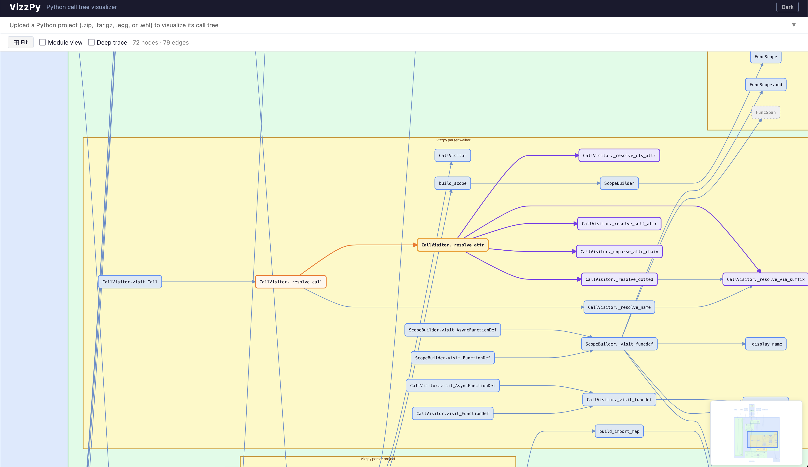

# VizzPy

> Understand any Python codebase in seconds — no instrumentation, no code changes, no runtime required.


 
VizzPy statically analyzes Python source files and renders an interactive call graph showing which functions call which, grouped by module hierarchy. Works on code you can't or don't want to run.

**Common uses:**
- Drop it in CI to auto-generate an always-fresh architecture diagram committed alongside the code
- Use interactive mode during code reviews to see exactly what changed and what it touches
- Onboard to an unfamiliar codebase without reading every file

## Features

- **Interactive web UI** — zoom, pan, drag nodes, collapse subtrees, dark mode, minimap
- **Single-click node focus** — click any node to highlight it (amber), its upstream callers (orange), and downstream callees (violet); click again or the background to clear; toggle **Immediate / Deep trace** to see one hop or the full call chain in both directions
- **Hierarchical module grouping** — `app.services.orders` is visually nested inside `app.services` inside `app`; depth-coded with distinct colors (blue → green → amber), consistent across all three output formats
- **Two granularity levels** — toggle between function-level and module-level graphs in the UI or via `--level`
- **Three output formats** — interactive browser UI, Mermaid markdown (CI-friendly, zero extra deps), and SVG (print-quality via Graphviz)
- **Cross-module resolution** — follows imports across files to draw edges between modules
- **External libraries separated** — stdlib and third-party calls shown in a distinct muted section; your code stays readable
- **Pre-load a project** — `--serve --project ./myapp` renders the graph before the browser opens
- **Archive upload** — drag-and-drop `.zip`, `.tar.gz`, `.egg`, or `.whl` in the web UI
- **Docstring tooltips** — hover any node to see the fully-qualified name and docstring (interactive and SVG)

## Installation

Install only what you need from [PyPI](https://pypi.org/project/vizzpy/):

| Goal | Command |
|---|---|
| Mermaid headless (CI-friendly, zero extra deps) | `pip install vizzpy` |
| SVG headless | `pip install 'vizzpy[svg]'` |
| Interactive web UI | `pip install 'vizzpy[serve]'` |
| Everything | `pip install 'vizzpy[all]'` |

SVG rendering additionally requires the [Graphviz](https://graphviz.org/download/) system package:

```bash
brew install graphviz   # macOS
apt install graphviz    # Debian/Ubuntu
```

## Usage

### Web UI

```bash
# open http://127.0.0.1:8000
vizzpy --serve

# pre-load a local project — graph renders immediately on page open
vizzpy --serve --project ./myproject
```

Upload a `.zip`, `.tar.gz`, `.egg`, or `.whl`, then click **Analyze**.

- **Scroll / pinch** to zoom  ·  **Drag background** to pan  ·  **Drag nodes** to rearrange
- **Single-click a node** to highlight it and its callers (orange) / callees (violet); click again or the background to clear
- **Immediate / Deep trace** button — switch between one-hop and full upstream + downstream chain highlighting
- **Double-click a node** to collapse/expand its downstream call subtree
- **Hover** a node to see its docstring
- **Function view / Module view** button — toggle granularity without re-uploading

### Headless rendering

```bash
# Mermaid (default) — no extra dependencies
vizzpy --headless --project ./myproject                          # → myproject_call_tree.md
vizzpy --headless --project ./myproject --level module           # module-level graph
vizzpy --headless --project ./myproject --level both             # both files in one run

# SVG — requires Graphviz
vizzpy --headless --project ./myproject --format svg
vizzpy --headless --project ./myproject --format svg --level both

# Layout engine (Mermaid only)
vizzpy --headless --project ./myproject --layout elk     # default: better for nested subgraphs
vizzpy --headless --project ./myproject --layout dagre   # classic Mermaid layout

# Custom output path
vizzpy --headless --project ./myproject --format mermaid --output graph.md
```

### Options

```
vizzpy --serve   [--host HOST] [--port PORT] [--project PROJECT_PATH]
vizzpy --headless --project PROJECT_PATH
                  [--format svg|mermaid]
                  [--level function|module|both]
                  [--layout elk|dagre]
                  [--output OUTPUT]
```

## CI Integration

Auto-generate a call graph on every push and commit it alongside your code so the architecture diagram is always up to date.

### GitHub Actions

```yaml
# .github/workflows/call-graph.yml
name: Update call graph

on:
  push:
    branches: [main]

jobs:
  call-graph:
    runs-on: ubuntu-latest
    permissions:
      contents: write
    steps:
      - uses: actions/checkout@v4

      - uses: actions/setup-python@v5
        with:
          python-version: "3.11"

      - name: Install VizzPy
        run: pip install vizzpy          # Mermaid only — no extra deps
        # run: pip install 'vizzpy[svg]' # uncomment for SVG output
        # run: sudo apt-get install -y graphviz && pip install 'vizzpy[svg]'

      - name: Generate call graph
        run: |
          vizzpy --headless --project . --level both
          # vizzpy --headless --project . --format svg --level both  # SVG variant

      - name: Commit updated graph
        run: |
          git config user.name  "github-actions[bot]"
          git config user.email "github-actions[bot]@users.noreply.github.com"
          git add *_call_tree*.md
          git diff --cached --quiet || git commit -m "chore: update call graph [skip ci]"
          git push
```

### GitLab CI

```yaml
# .gitlab-ci.yml  (add as a job or include in an existing pipeline)
call-graph:
  stage: build
  image: python:3.11-slim
  rules:
    - if: $CI_COMMIT_BRANCH == $CI_DEFAULT_BRANCH
  before_script:
    - pip install vizzpy                 # Mermaid only — no extra deps
    # - apt-get install -y graphviz && pip install 'vizzpy[svg]'  # SVG variant
  script:
    - vizzpy --headless --project . --level both
    # - vizzpy --headless --project . --format svg --level both   # SVG variant
  after_script:
    - git config user.name  "gitlab-ci-bot"
    - git config user.email "gitlab-ci-bot@example.com"
    - git add *_call_tree*.md
    - git diff --cached --quiet || git commit -m "chore: update call graph [skip ci]"
    - git push "https://oauth2:${CI_JOB_TOKEN}@${CI_SERVER_HOST}/${CI_PROJECT_PATH}.git" HEAD:${CI_COMMIT_BRANCH}
  artifacts:
    paths:
      - "*_call_tree*.md"
    expire_in: 30 days
```

Both pipelines generate `<project>_call_tree_functions.md` and `<project>_call_tree_modules.md` and commit them back to the branch. The `[skip ci]` tag prevents the commit from triggering another pipeline run.

## How it works

VizzPy uses Python's `ast` module to do a two-pass analysis of your source files:

1. **Scope pass** — collects every function and class method with its qualified name (`module.ClassName.method`)
2. **Edge pass** — walks each file again, resolves `self.method()`, `cls.method()`, imported names, and direct calls to project-internal functions

Results are rendered with [dagre-d3](https://github.com/dagrejs/dagre-d3) (vendored, works offline). Calls to external libraries are shown as muted leaf nodes — their internals are not traced.

> **Why static analysis instead of runtime tracing?** Static analysis covers all code paths (not just exercised ones), works on untrusted or incomplete code, and adds zero dependencies to the analyzed project.

## Development

```bash
git clone https://github.com/atulsaurav/vizzpy
cd vizzpy
pip install -e ".[dev]"

pytest                                          # run tests
pytest --cov=vizzpy --cov-report=term-missing   # with coverage
```

## License

Apache-2.0
