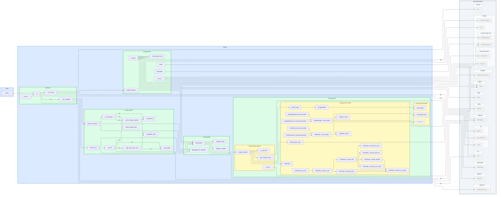

```mermaid
%%{init: {"flowchart": {"defaultRenderer": "elk"}} }%%
flowchart LR
    subgraph main["main"]
        main____main___["__main__"]
    end
    subgraph vizzpy["vizzpy"]
        direction LR
        subgraph vizzpy_cli["vizzpy.cli"]
            vizzpy__cli____main___["__main__"]
            vizzpy__cli___run_headless_["_run_headless"]
            vizzpy__cli___run_server_["_run_server"]
            vizzpy__cli__cli_["cli"]
        end
        subgraph vizzpy_graph["vizzpy.graph"]
            vizzpy__graph___fallback_label_["_fallback_label"]
            vizzpy__graph___fallback_module_["_fallback_module"]
            vizzpy__graph__aggregate_to_modules_["aggregate_to_modules"]
            vizzpy__graph__build_graph_["build_graph"]
        end
        subgraph vizzpy_parser["vizzpy.parser"]
            direction LR
            subgraph vizzpy_parser_project["vizzpy.parser.project"]
                vizzpy__parser__project____main___["__main__"]
                vizzpy__parser__project___is_test_file_["_is_test_file"]
                vizzpy__parser__project__analyze_project_["analyze_project"]
                vizzpy__parser__project__get_module_name_["get_module_name"]
            end
            subgraph vizzpy_parser_scope["vizzpy.parser.scope"]
                vizzpy__parser__scope__FuncScope_["FuncScope"]
                vizzpy__parser__scope__FuncScope__add_["FuncScope.add"]
                vizzpy__parser__scope__FuncSpan_["FuncSpan"]
            end
            subgraph vizzpy_parser_walker["vizzpy.parser.walker"]
                vizzpy__parser__walker__CallVisitor_["CallVisitor"]
                vizzpy__parser__walker__CallVisitor___resolve_attr_["CallVisitor._resolve_attr"]
                vizzpy__parser__walker__CallVisitor___resolve_call_["CallVisitor._resolve_call"]
                vizzpy__parser__walker__CallVisitor___resolve_cls_attr_["CallVisitor._resolve_cls_attr"]
                vizzpy__parser__walker__CallVisitor___resolve_dotted_["CallVisitor._resolve_dotted"]
                vizzpy__parser__walker__CallVisitor___resolve_name_["CallVisitor._resolve_name"]
                vizzpy__parser__walker__CallVisitor___resolve_self_attr_["CallVisitor._resolve_self_attr"]
                vizzpy__parser__walker__CallVisitor___resolve_via_suffix_["CallVisitor._resolve_via_suffix"]
                vizzpy__parser__walker__CallVisitor___unparse_attr_chain_["CallVisitor._unparse_attr_chain"]
                vizzpy__parser__walker__CallVisitor___visit_funcdef_["CallVisitor._visit_funcdef"]
                vizzpy__parser__walker__CallVisitor__visit_AsyncFunctionDef_["CallVisitor.visit_AsyncFunctionDef"]
                vizzpy__parser__walker__CallVisitor__visit_Call_["CallVisitor.visit_Call"]
                vizzpy__parser__walker__CallVisitor__visit_FunctionDef_["CallVisitor.visit_FunctionDef"]
                vizzpy__parser__walker__ScopeBuilder_["ScopeBuilder"]
                vizzpy__parser__walker__ScopeBuilder___visit_funcdef_["ScopeBuilder._visit_funcdef"]
                vizzpy__parser__walker__ScopeBuilder__visit_AsyncFunctionDef_["ScopeBuilder.visit_AsyncFunctionDef"]
                vizzpy__parser__walker__ScopeBuilder__visit_FunctionDef_["ScopeBuilder.visit_FunctionDef"]
                vizzpy__parser__walker___display_name_["_display_name"]
                vizzpy__parser__walker___qualified_name_["_qualified_name"]
                vizzpy__parser__walker__build_import_map_["build_import_map"]
                vizzpy__parser__walker__build_scope_["build_scope"]
            end
        end
        subgraph vizzpy_render["vizzpy.render"]
            vizzpy__render___add_dot_cluster_tree_["_add_dot_cluster_tree"]
            vizzpy__render___build_module_tree_["_build_module_tree"]
            vizzpy__render___dot_tooltip_["_dot_tooltip"]
            vizzpy__render___emit_module_subtree_["_emit_module_subtree"]
            vizzpy__render___mermaid_id_["_mermaid_id"]
            vizzpy__render___subgraph_style_["_subgraph_style"]
            vizzpy__render___to_dot_["_to_dot"]
            vizzpy__render___to_mermaid_["_to_mermaid"]
            vizzpy__render__render_mermaid_["render_mermaid"]
            vizzpy__render__render_svg_["render_svg"]
        end
        subgraph vizzpy_server["vizzpy.server"]
            vizzpy__server____main___["__main__"]
            vizzpy__server___find_project_root_["_find_project_root"]
            vizzpy__server__analyze_["analyze"]
            vizzpy__server__index_["index"]
            vizzpy__server__preload_project_["preload_project"]
            vizzpy__server__preloaded_["preloaded"]
        end
    end
    subgraph __ext__["external libraries"]
        direction LR
        subgraph argparse["argparse"]
            argparse__ArgumentParser_["ArgumentParser"]
        end
        subgraph ast["ast"]
            ast__get_docstring_["get_docstring"]
            ast__parse_["parse"]
            ast__walk_["walk"]
        end
        subgraph collections["collections"]
            collections__defaultdict_["defaultdict"]
        end
        subgraph fastapi["fastapi"]
            direction LR
            fastapi__FastAPI_["FastAPI"]
            fastapi__File_["File"]
            fastapi__HTTPException_["HTTPException"]
            subgraph fastapi_responses["fastapi.responses"]
                fastapi__responses__FileResponse_["FileResponse"]
                fastapi__responses__JSONResponse_["JSONResponse"]
            end
            subgraph fastapi_staticfiles["fastapi.staticfiles"]
                fastapi__staticfiles__StaticFiles_["StaticFiles"]
            end
        end
        subgraph graphviz["graphviz"]
            graphviz__Digraph_["Digraph"]
        end
        subgraph logging["logging"]
            logging__getLogger_["getLogger"]
        end
        subgraph pathlib["pathlib"]
            pathlib__Path_["Path"]
        end
        subgraph sys["sys"]
            sys__exit_["exit"]
        end
        subgraph tarfile["tarfile"]
            tarfile__open_["open"]
        end
        subgraph tempfile["tempfile"]
            tempfile__TemporaryDirectory_["TemporaryDirectory"]
        end
        subgraph uvicorn["uvicorn"]
            uvicorn__run_["run"]
        end
        subgraph zipfile["zipfile"]
            zipfile__ZipFile_["ZipFile"]
        end
    end
    style main fill:#dbeafe,stroke:#3b82f6,color:#1e3a8a,stroke-width:2px
    style vizzpy fill:#dbeafe,stroke:#3b82f6,color:#1e3a8a,stroke-width:2px
    style vizzpy_cli fill:#dcfce7,stroke:#16a34a,color:#14532d,stroke-width:2px
    style vizzpy_graph fill:#dcfce7,stroke:#16a34a,color:#14532d,stroke-width:2px
    style vizzpy_parser fill:#dcfce7,stroke:#16a34a,color:#14532d,stroke-width:2px
    style vizzpy_parser_project fill:#fef9c3,stroke:#ca8a04,color:#713f12,stroke-width:2px
    style vizzpy_parser_scope fill:#fef9c3,stroke:#ca8a04,color:#713f12,stroke-width:2px
    style vizzpy_parser_walker fill:#fef9c3,stroke:#ca8a04,color:#713f12,stroke-width:2px
    style vizzpy_render fill:#dcfce7,stroke:#16a34a,color:#14532d,stroke-width:2px
    style vizzpy_server fill:#dcfce7,stroke:#16a34a,color:#14532d,stroke-width:2px
    style __ext__ fill:#f1f5f9,stroke:#64748b,color:#1e293b,stroke-width:2px
    style argparse fill:#f8fafc,stroke:#94a3b8,color:#334155,stroke-width:1px
    style ast fill:#f8fafc,stroke:#94a3b8,color:#334155,stroke-width:1px
    style collections fill:#f8fafc,stroke:#94a3b8,color:#334155,stroke-width:1px
    style fastapi fill:#f8fafc,stroke:#94a3b8,color:#334155,stroke-width:1px
    style fastapi_responses fill:#f8fafc,stroke:#94a3b8,color:#334155,stroke-width:1px
    style fastapi_staticfiles fill:#f8fafc,stroke:#94a3b8,color:#334155,stroke-width:1px
    style graphviz fill:#f8fafc,stroke:#94a3b8,color:#334155,stroke-width:1px
    style logging fill:#f8fafc,stroke:#94a3b8,color:#334155,stroke-width:1px
    style pathlib fill:#f8fafc,stroke:#94a3b8,color:#334155,stroke-width:1px
    style sys fill:#f8fafc,stroke:#94a3b8,color:#334155,stroke-width:1px
    style tarfile fill:#f8fafc,stroke:#94a3b8,color:#334155,stroke-width:1px
    style tempfile fill:#f8fafc,stroke:#94a3b8,color:#334155,stroke-width:1px
    style uvicorn fill:#f8fafc,stroke:#94a3b8,color:#334155,stroke-width:1px
    style zipfile fill:#f8fafc,stroke:#94a3b8,color:#334155,stroke-width:1px
    main____main___ --> vizzpy__cli__cli_
    vizzpy__cli____main___ --> vizzpy__cli__cli_
    vizzpy__cli___run_headless_ -->|"2x"| sys__exit_
    vizzpy__cli___run_headless_ --> vizzpy__render__render_mermaid_
    vizzpy__cli___run_headless_ --> vizzpy__render__render_svg_
    vizzpy__cli___run_server_ -->|"2x"| sys__exit_
    vizzpy__cli___run_server_ --> uvicorn__run_
    vizzpy__cli___run_server_ --> vizzpy__server__preload_project_
    vizzpy__cli__cli_ --> argparse__ArgumentParser_
    vizzpy__cli__cli_ -->|"7x"| pathlib__Path_
    vizzpy__cli__cli_ -->|"3x"| vizzpy__cli___run_headless_
    vizzpy__cli__cli_ --> vizzpy__cli___run_server_
    vizzpy__graph__build_graph_ -->|"2x"| collections__defaultdict_
    vizzpy__graph__build_graph_ --> vizzpy__graph___fallback_label_
    vizzpy__graph__build_graph_ --> vizzpy__graph___fallback_module_
    vizzpy__graph__build_graph_ --> vizzpy__parser__project__analyze_project_
    vizzpy__parser__project____main___ --> logging__getLogger_
    vizzpy__parser__project__analyze_project_ --> ast__parse_
    vizzpy__parser__project__analyze_project_ --> vizzpy__parser__project___is_test_file_
    vizzpy__parser__project__analyze_project_ --> vizzpy__parser__project__get_module_name_
    vizzpy__parser__project__analyze_project_ --> vizzpy__parser__walker__CallVisitor_
    vizzpy__parser__project__analyze_project_ --> vizzpy__parser__walker__build_import_map_
    vizzpy__parser__project__analyze_project_ --> vizzpy__parser__walker__build_scope_
    vizzpy__parser__walker__CallVisitor___resolve_attr_ --> vizzpy__parser__walker__CallVisitor___resolve_cls_attr_
    vizzpy__parser__walker__CallVisitor___resolve_attr_ --> vizzpy__parser__walker__CallVisitor___resolve_dotted_
    vizzpy__parser__walker__CallVisitor___resolve_attr_ --> vizzpy__parser__walker__CallVisitor___resolve_self_attr_
    vizzpy__parser__walker__CallVisitor___resolve_attr_ --> vizzpy__parser__walker__CallVisitor___resolve_via_suffix_
    vizzpy__parser__walker__CallVisitor___resolve_attr_ --> vizzpy__parser__walker__CallVisitor___unparse_attr_chain_
    vizzpy__parser__walker__CallVisitor___resolve_call_ --> vizzpy__parser__walker__CallVisitor___resolve_attr_
    vizzpy__parser__walker__CallVisitor___resolve_call_ --> vizzpy__parser__walker__CallVisitor___resolve_name_
    vizzpy__parser__walker__CallVisitor___resolve_dotted_ --> vizzpy__parser__walker__CallVisitor___resolve_via_suffix_
    vizzpy__parser__walker__CallVisitor___resolve_name_ --> vizzpy__parser__walker__CallVisitor___resolve_via_suffix_
    vizzpy__parser__walker__CallVisitor___visit_funcdef_ --> vizzpy__parser__walker___qualified_name_
    vizzpy__parser__walker__CallVisitor__visit_AsyncFunctionDef_ --> vizzpy__parser__walker__CallVisitor___visit_funcdef_
    vizzpy__parser__walker__CallVisitor__visit_Call_ --> vizzpy__parser__walker__CallVisitor___resolve_call_
    vizzpy__parser__walker__CallVisitor__visit_FunctionDef_ --> vizzpy__parser__walker__CallVisitor___visit_funcdef_
    vizzpy__parser__walker__ScopeBuilder_ --> vizzpy__parser__scope__FuncScope_
    vizzpy__parser__walker__ScopeBuilder___visit_funcdef_ --> ast__get_docstring_
    vizzpy__parser__walker__ScopeBuilder___visit_funcdef_ --> vizzpy__parser__scope__FuncScope__add_
    vizzpy__parser__walker__ScopeBuilder___visit_funcdef_ --> vizzpy__parser__scope__FuncSpan_
    vizzpy__parser__walker__ScopeBuilder___visit_funcdef_ --> vizzpy__parser__walker___display_name_
    vizzpy__parser__walker__ScopeBuilder___visit_funcdef_ --> vizzpy__parser__walker___qualified_name_
    vizzpy__parser__walker__ScopeBuilder__visit_AsyncFunctionDef_ --> vizzpy__parser__walker__ScopeBuilder___visit_funcdef_
    vizzpy__parser__walker__ScopeBuilder__visit_FunctionDef_ --> vizzpy__parser__walker__ScopeBuilder___visit_funcdef_
    vizzpy__parser__walker__build_import_map_ --> ast__walk_
    vizzpy__parser__walker__build_scope_ --> vizzpy__parser__walker__ScopeBuilder_
    vizzpy__render___add_dot_cluster_tree_ -->|"2x"| vizzpy__render___dot_tooltip_
    vizzpy__render___add_dot_cluster_tree_ --> vizzpy__render___subgraph_style_
    vizzpy__render___emit_module_subtree_ --> vizzpy__render___mermaid_id_
    vizzpy__render___emit_module_subtree_ --> vizzpy__render___subgraph_style_
    vizzpy__render___to_dot_ --> graphviz__Digraph_
    vizzpy__render___to_dot_ -->|"2x"| vizzpy__render___add_dot_cluster_tree_
    vizzpy__render___to_dot_ -->|"2x"| vizzpy__render___build_module_tree_
    vizzpy__render___to_dot_ -->|"2x"| vizzpy__render___dot_tooltip_
    vizzpy__render___to_mermaid_ -->|"2x"| vizzpy__render___build_module_tree_
    vizzpy__render___to_mermaid_ -->|"2x"| vizzpy__render___emit_module_subtree_
    vizzpy__render___to_mermaid_ -->|"4x"| vizzpy__render___mermaid_id_
    vizzpy__render__render_mermaid_ --> vizzpy__graph__aggregate_to_modules_
    vizzpy__render__render_mermaid_ --> vizzpy__graph__build_graph_
    vizzpy__render__render_mermaid_ --> vizzpy__render___to_mermaid_
    vizzpy__render__render_svg_ --> vizzpy__graph__aggregate_to_modules_
    vizzpy__render__render_svg_ --> vizzpy__graph__build_graph_
    vizzpy__render__render_svg_ --> vizzpy__render___to_dot_
    vizzpy__server____main___ --> fastapi__FastAPI_
    vizzpy__server____main___ --> fastapi__staticfiles__StaticFiles_
    vizzpy__server____main___ --> logging__getLogger_
    vizzpy__server____main___ --> pathlib__Path_
    vizzpy__server__analyze_ --> fastapi__File_
    vizzpy__server__analyze_ -->|"4x"| fastapi__HTTPException_
    vizzpy__server__analyze_ --> fastapi__responses__JSONResponse_
    vizzpy__server__analyze_ --> pathlib__Path_
    vizzpy__server__analyze_ --> tarfile__open_
    vizzpy__server__analyze_ --> tempfile__TemporaryDirectory_
    vizzpy__server__analyze_ --> vizzpy__graph__build_graph_
    vizzpy__server__analyze_ --> vizzpy__server___find_project_root_
    vizzpy__server__analyze_ --> zipfile__ZipFile_
    vizzpy__server__index_ --> fastapi__responses__FileResponse_
    vizzpy__server__preload_project_ --> vizzpy__graph__build_graph_
    vizzpy__server__preloaded_ --> fastapi__responses__JSONResponse_
    classDef external fill:#f0f0f0,stroke:#aaaaaa,color:#888888,stroke-dasharray:4
    class argparse__ArgumentParser_,ast__get_docstring_,ast__parse_,ast__walk_,collections__defaultdict_,fastapi__FastAPI_,fastapi__File_,fastapi__HTTPException_,fastapi__responses__FileResponse_,fastapi__responses__JSONResponse_,fastapi__staticfiles__StaticFiles_,graphviz__Digraph_,logging__getLogger_,pathlib__Path_,sys__exit_,tarfile__open_,tempfile__TemporaryDirectory_,uvicorn__run_,vizzpy__parser__scope__FuncSpan_,zipfile__ZipFile_ external
```
