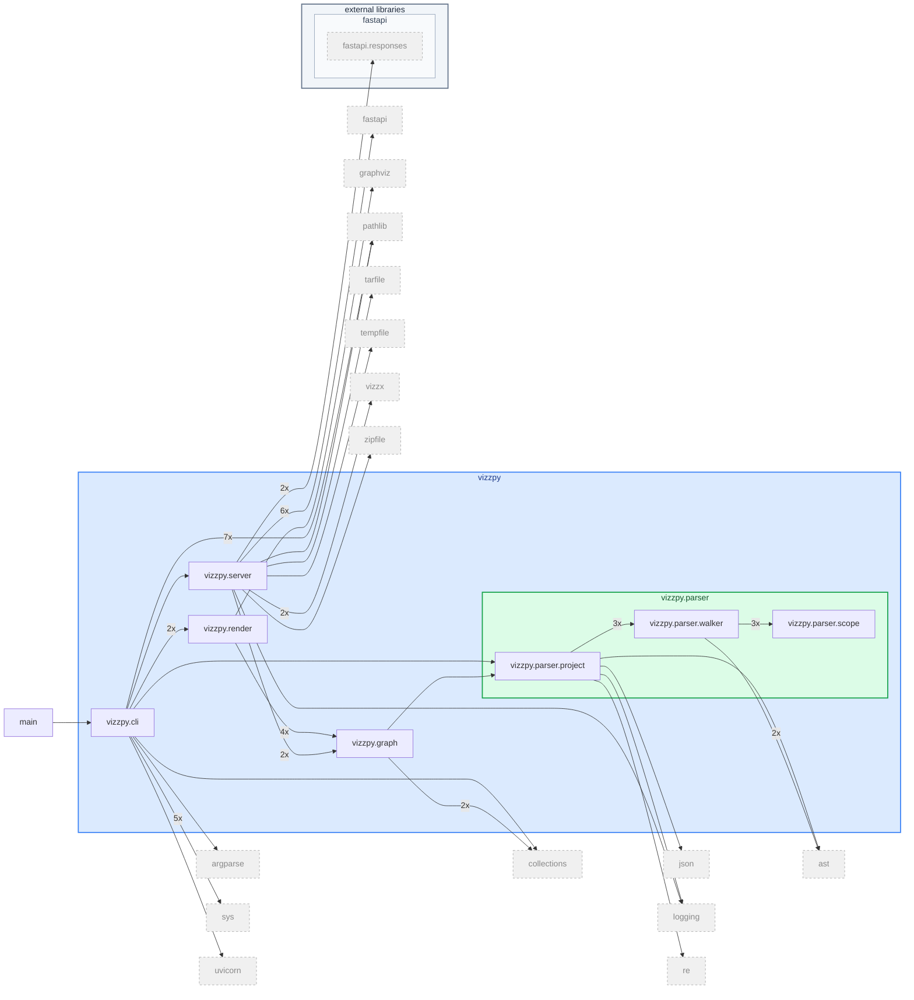

```mermaid
flowchart LR
    subgraph vizzpy["vizzpy"]
        direction LR
        vizzpy__cli_["vizzpy.cli"]
        vizzpy__graph_["vizzpy.graph"]
        vizzpy__render_["vizzpy.render"]
        vizzpy__server_["vizzpy.server"]
        subgraph vizzpy_parser["vizzpy.parser"]
            vizzpy__parser__project_["vizzpy.parser.project"]
            vizzpy__parser__scope_["vizzpy.parser.scope"]
            vizzpy__parser__walker_["vizzpy.parser.walker"]
        end
    end
    argparse_["argparse"]
    ast_["ast"]
    collections_["collections"]
    fastapi_["fastapi"]
    graphviz_["graphviz"]
    json_["json"]
    logging_["logging"]
    main_["main"]
    pathlib_["pathlib"]
    re_["re"]
    sys_["sys"]
    tarfile_["tarfile"]
    tempfile_["tempfile"]
    uvicorn_["uvicorn"]
    vizzx_["vizzx"]
    zipfile_["zipfile"]
    subgraph __ext__["external libraries"]
        direction LR
        subgraph fastapi["fastapi"]
            fastapi__responses_["fastapi.responses"]
        end
    end
    style vizzpy fill:#dbeafe,stroke:#3b82f6,color:#1e3a8a,stroke-width:2px
    style vizzpy_parser fill:#dcfce7,stroke:#16a34a,color:#14532d,stroke-width:2px
    style __ext__ fill:#f1f5f9,stroke:#64748b,color:#1e293b,stroke-width:2px
    style fastapi fill:#f8fafc,stroke:#94a3b8,color:#334155,stroke-width:1px
    main_ --> vizzpy__cli_
    vizzpy__cli_ --> argparse_
    vizzpy__cli_ --> collections_
    vizzpy__cli_ -->|"7x"| pathlib_
    vizzpy__cli_ -->|"5x"| sys_
    vizzpy__cli_ --> uvicorn_
    vizzpy__cli_ --> vizzpy__parser__project_
    vizzpy__cli_ -->|"2x"| vizzpy__render_
    vizzpy__cli_ --> vizzpy__server_
    vizzpy__graph_ -->|"2x"| collections_
    vizzpy__graph_ --> vizzpy__parser__project_
    vizzpy__parser__project_ --> ast_
    vizzpy__parser__project_ --> json_
    vizzpy__parser__project_ --> logging_
    vizzpy__parser__project_ --> re_
    vizzpy__parser__project_ -->|"3x"| vizzpy__parser__walker_
    vizzpy__parser__walker_ -->|"2x"| ast_
    vizzpy__parser__walker_ -->|"3x"| vizzpy__parser__scope_
    vizzpy__render_ --> graphviz_
    vizzpy__render_ -->|"4x"| vizzpy__graph_
    vizzpy__server_ -->|"6x"| fastapi_
    vizzpy__server_ -->|"2x"| fastapi__responses_
    vizzpy__server_ --> logging_
    vizzpy__server_ --> pathlib_
    vizzpy__server_ --> tarfile_
    vizzpy__server_ --> tempfile_
    vizzpy__server_ -->|"2x"| vizzpy__graph_
    vizzpy__server_ -->|"2x"| vizzx_
    vizzpy__server_ --> zipfile_
    classDef external fill:#f0f0f0,stroke:#aaaaaa,color:#888888,stroke-dasharray:4
    class argparse_,ast_,collections_,fastapi_,fastapi__responses_,graphviz_,json_,logging_,pathlib_,re_,sys_,tarfile_,tempfile_,uvicorn_,vizzx_,zipfile_ external
```
